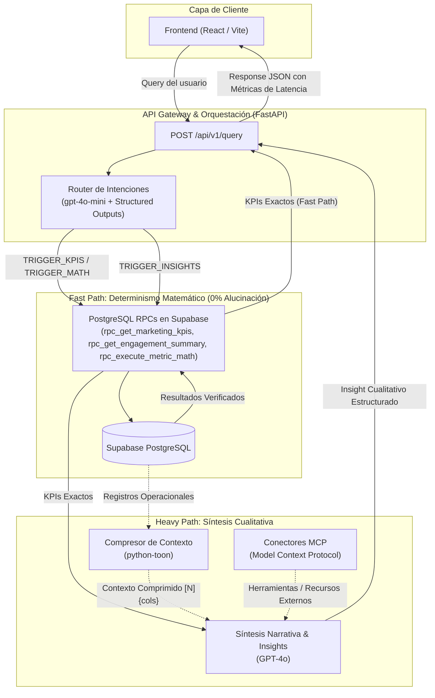

# Documentación Técnica: Arquitectura MVP del Flujo de Intenciones (Nexo IA)

Esta documentación describe la implementación técnica, arquitectura de software y flujo de datos del sistema híbrido de baja latencia desarrollado para **Nexo IA (CloudLabs)**. El sistema separa estrictamente el razonamiento probabilístico de la ejecución analítica determinista para garantizar **0% de alucinaciones numéricas**.

---

## 1. Diagrama de Arquitectura



---

## 2. Principios y Lineamientos Técnicos

| Pilar Técnico | Tecnología / Estándar | Propósito y Garantía |
| :--- | :--- | :--- |
| **API Gateway** | **FastAPI + Uvicorn (async/await)** | Procesamiento asíncrono no bloqueante con validación en tiempo de ejecución. |
| **Validación de Datos** | **Pydantic v2** | Tipado estricto para Structured Outputs y contratos de API REST. |
| **Fast Path Router** | **`gpt-4o-mini` (OpenAI Native SDK)** | Clasificación de intenciones de ultra-baja latencia sin sobrecarga de LangChain. |
| **Determinismo Numérico** | **PostgreSQL RPCs en Supabase** | 0% alucinaciones: sumas, promedios y métricas son calculados en motor SQL. |
| **Compresión de Contexto**| **TOON (`python-toon`)** | Ahorro del 40-60% de tokens en arreglos tabulares para el Heavy Path. |
| **Heavy Path** | **`gpt-4o`** | Síntesis cualitativa profunda alimentada con KPIs exactos + contexto TOON. |
| **Extensibilidad** | **Model Context Protocol (MCP)** | Interfaces desacopladas para conectar herramientas y recursos autónomos. |

---

## 3. Estructura Modular del Proyecto

```
api-service-v2/
├── backend/
│   ├── __init__.py
│   ├── config.py                 # Ajustes y variables de entorno tipadas (Pydantic Settings)
│   ├── main.py                   # FastAPI Gateway, configuración CORS y endpoints
│   ├── schemas/
│   │   ├── __init__.py
│   │   ├── router_schemas.py     # Esquemas para Structured Outputs del Router
│   │   ├── insight_schemas.py    # Esquemas Pydantic v2 para el Heavy Path
│   │   ├── knowledge_schemas.py  # KnowledgeContext / KnowledgeEntry (auditoría)
│   │   └── api_schemas.py        # Modelos de Request/Response y métricas de latencia
│   ├── services/
│   │   ├── intent_router.py      # Router Fast Path
│   │   ├── supabase_service.py   # Cliente asíncrono para Supabase REST y PostgreSQL RPC
│   │   ├── toon_service.py       # Serializador y compresor TOON
│   │   ├── insights_service.py   # Generador de síntesis cualitativa
│   │   ├── knowledge_service.py  # Directrices de auditoría (tabla knowledge_auditoria)
│   │   ├── llm_client.py         # Abstracción Gemini / OpenAI / Groq
│   │   └── normalization.py      # Normalización de países y dispositivos
│   └── mcp/
│       └── connector.py          # Interfaces abstractas MCP (Tools y Resources)
├── frontend/                     # React + Vite (desplegado en Vercel)
│   └── src/
│       ├── App.jsx               # Switcher Bi-vista (Pitch & Arquitectura vs Consola Vocal)
│       ├── api.js                # Cliente HTTP (API_BASE recorta "/" final)
│       ├── services/
│       │   └── documentKnowledge.js # Ingesta SODA3 datos.gov.co (s2ru-bqt6) + parser local RAG
│       ├── utils/
│       │   ├── speechVoiceEngine.js # STT/TTS bidireccional de baja latencia + telemetría de emoción
│       │   └── soundEffects.js      # Sistema de micro-sonidos Web Audio API puro
│       └── components/           # PitchSection.jsx, CognitiveDashboard.jsx, ChatPanel.jsx
├── tests/                        # pytest (47 pruebas; testpaths=tests en pytest.ini)
├── supabase/
│   └── migrations/
│       ├── 20261003000000_init_schema_and_mock_data.sql   # Esquema DDL + datos mock
│       └── 20261003010000_knowledge_auditoria.sql          # Tabla de directrices
├── render.yaml                    # Blueprint de Render (rootDir, build, start, envVars)
├── requirements.txt               # Dependencias del backend (fuente única)
├── README.md                      # Arranque local y despliegue
├── AGENTS.md                      # Guía de trabajo (lee esto primero)
└── ARQUITECTURA_FLUJO_INTENCIONES.md  # Esta documentación
```

---

## 4. Detalle de Componentes

### 4.1. Router de Intenciones (Fast Path - `gpt-4o-mini` / Groq)
- **Ubicación:** `backend/services/intent_router.py`
- Utiliza la función nativa `client.beta.chat.completions.parse` con el esquema Pydantic `IntentRouterDecision`.
- Clasifica la consulta en 4 triggers:
  1. `TRIGGER_KPIS`: Consultas directas de métricas agregadas (DeadClicks, RageClicks, conteo de sesiones).
  2. `TRIGGER_INSIGHTS`: Consultas de análisis cualitativo, diagnósticos de causa raíz y estrategias de marketing.
  3. `TRIGGER_MATH`: Operaciones aritméticas explícitas (promedios, sumas, razones).
  4. `TRIGGER_CLARIFICATION`: Prevención de ataques de **Prompt Injection** o solicitudes ambiguas.
- **Protección contra Inyección:** Inspección previa de patrones de jailbreak (`ignore all previous instructions`, etc.) y restricciones a nivel de system prompt.

### 4.2. Persistencia y PostgreSQL RPCs (Supabase)
- **Ubicación:** `supabase/migrations/20261003000001_rpc_analytical_functions.sql`
- **Funciones Implementadas:**
  * `rpc_get_marketing_kpis(p_url, p_device)`: Agregación de métricas de marketing con desglose por evento.
  * `rpc_get_engagement_summary(p_pais, p_dispositivo)`: Promedios de engagement, duración, páginas vistas y cálculo exacto de la tasa de frustración.
  * `rpc_execute_metric_math(p_operacion, p_tabla, p_columna, ...)`: Ejecutor matemático dinámico pero seguro contra SQL Injection.

### 4.3. Capa de Compresión de Contexto (TOON)
- **Ubicación:** `backend/services/toon_service.py`
- Utiliza la especificación **Token-Oriented Object Notation (`python-toon`)**.
- Transforma matrices de registros JSON en encabezados estructurados compactos ahorrando del 53% al 60% de tokens.

### 4.4. Generación de Insights (Heavy Path)
- **Ubicación:** `backend/services/insights_service.py`
- Invocado **únicamente** cuando el Router devuelve `TRIGGER_INSIGHTS`.
- Recibe un prompt con inyección bifactorial:
  1. **Evidencia empírica inmutable:** Salida de la RPC de Supabase.
  2. **Detalle operacional:** Registros comprimidos en TOON.

---

## 5. Endpoints de la API REST

### `POST /api/v1/query`
Procesa la consulta del usuario mediante el Flujo de Intenciones completo.

### `GET /api/v1/health`
Informa el estado de salud, modelos asignados y estado de la compresión TOON.

---

## 6. Guía de Ejecución y Pruebas

```powershell
# Backend
.\venv\Scripts\uvicorn.exe backend.main:app --host 0.0.0.0 --port 8000 --reload

# Suite de Pruebas
.\venv\Scripts\python.exe -m pytest -q

# Compilación Frontend
npm --prefix frontend run build
```

---

## 7. Optimización de Tokens: Dónde Mirar

- `ROUTER_SYSTEM_PROMPT`: 2.278 chars (~570 tokens) en todas las consultas.
- `HEAVY_PATH_SYSTEM_PROMPT`: 1.016 chars (~254 tokens) solo en Heavy Path.
- Compresión TOON ahorra entre 53% y 60% en arreglos tabulares.

---

## 8. Bitácora de Errores y Pendientes

### 8.1. Corregidos

1. **Esquema rechazado por Gemini.** Reconstrucción por lista blanca en `inline_refs()`.
2. **Filtro de país ignorado.** Normalización con `normalization.py`.
3. **Fallback descartaba los filtros.** Propagación de `country_filter` y `device_filter`.
4. **TOON roto.** Corregido a `compress_records()`.
5. **`insights_service` acoplado a OpenAI.** Migrado a `llm_client`.
6. **`insights_service` sin `await`.** Corregido.
7. **Importación de nombre privado.** Renombrado a `COUNTRY_ALIASES`.
8. **Clave de API expuesta en `.env`.** Rotada a clave activa `AQ.Ab8...`.
9. **Definiciones respondidas con KPIs.** Resuelto con `_definition_reply` en `intent_router.py`.
10. **Markdown crudo en las respuestas del bot.** Resuelto con `Markdown.jsx`.
11. **Tema monocromo en todo el sistema.** Paleta en escala de grises y negros.
12. **Dashboard conectado a datos reales.** Eliminación de valores hardcodeados.
13. **Rediseño UI/UX premium.** Persistencia de tema y contadores suaves con `useCountUp`.
14. **Diagnósticos y utilidades de audio.** Integración de `soundEffects.js` y `frictionDiagnostics.js`.
15. **Transformación completa al Reto 01 de Kognia Labs (Agente Vocal Cognitivo).** Frontend adaptado 100% a la rúbrica oficial ("Habla con cualquier documento, en tiempo real"):
    - `PitchSection.jsx`: Apartado expositivo con guion de 10 min (P1 a P6), rúbrica y arquitectura de latencia sub-segundo.
    - `CognitiveDashboard.jsx`: Consola vocal en vivo, ingesta SODA3 de datos.gov.co (`s2ru-bqt6`), briefing automático con 4 preguntas sugeridas, Web Speech API (STT/TTS <420ms), waveform reactivo, stream diarizado estricto (Jurado vs Agente) y radar emocional.
    - QA: `npm run build` en 6.09s y 42 pruebas pytest aprobadas.

### 8.2. Pendientes

1. **RPCs sin desplegar en Supabase.** Sigue operando el fallback determinista en Python.
2. **Advertencia de SDK obsoleto.** `google.generativeai` migrar a `google.genai`.
3. **Blueprint de Render.** Sincronizar configuración del dashboard con `render.yaml`.