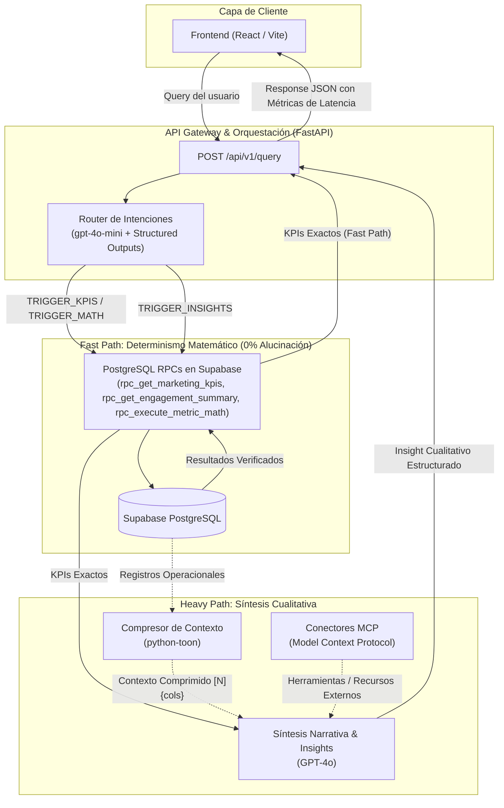

# Documentación Técnica: Arquitectura MVP del Flujo de Intenciones (Nexo IA)

Esta documentación describe la implementación técnica, arquitectura de software y flujo de datos del sistema híbrido de baja latencia desarrollado para **Nexo IA (CloudLabs)**. El sistema separa estrictamente el razonamiento probabilístico de la ejecución analítica determinista para garantizar **0% de alucinaciones numéricas**.

---

## 1. Diagrama de Arquitectura



---

## 2. Principios y Lineamientos Técnicos

| Pilar Técnico | Tecnología / Estándar | Propósito y Garantía |
| :--- | :--- | :--- |
| **API Gateway** | **FastAPI + Uvicorn (async/await)** | Procesamiento asíncrono no bloqueante con validación en tiempo de ejecución. |
| **Validación de Datos** | **Pydantic v2** | Tipado estricto para Structured Outputs y contratos de API REST. |
| **Fast Path Router** | **`gpt-4o-mini` (OpenAI Native SDK)** | Clasificación de intenciones de ultra-baja latencia sin sobrecarga de LangChain. |
| **Determinismo Numérico** | **PostgreSQL RPCs en Supabase** | 0% alucinaciones: sumas, promedios y métricas son calculados en motor SQL. |
| **Compresión de Contexto**| **TOON (`python-toon`)** | Ahorro del 40-60% de tokens en arreglos tabulares para el Heavy Path. |
| **Heavy Path** | **`gpt-4o`** | Síntesis cualitativa profunda alimentada con KPIs exactos + contexto TOON. |
| **Extensibilidad** | **Model Context Protocol (MCP)** | Interfaces desacopladas para conectar herramientas y recursos autónomos. |

---

## 3. Estructura Modular del Proyecto

```
api-service-v2/
├── backend/
│   ├── __init__.py
│   ├── config.py                 # Ajustes y variables de entorno tipadas (Pydantic Settings)
│   ├── main.py                   # FastAPI Gateway, configuración CORS y endpoints
│   ├── schemas/
│   │   ├── __init__.py
│   │   ├── router_schemas.py     # Esquemas para Structured Outputs del Router
│   │   ├── insight_schemas.py    # Esquemas Pydantic v2 para el Heavy Path
│   │   ├── knowledge_schemas.py  # KnowledgeContext / KnowledgeEntry (auditoría)
│   │   └── api_schemas.py        # Modelos de Request/Response y métricas de latencia
│   ├── services/
│   │   ├── intent_router.py      # Router Fast Path
│   │   ├── supabase_service.py   # Cliente asíncrono para Supabase REST y PostgreSQL RPC
│   │   ├── toon_service.py       # Serializador y compresor TOON
│   │   ├── insights_service.py   # Generador de síntesis cualitativa
│   │   ├── knowledge_service.py  # Directrices de auditoría (tabla knowledge_auditoria)
│   │   ├── llm_client.py         # Abstracción Gemini / OpenAI / Groq
│   │   └── normalization.py      # Normalización de países y dispositivos
│   └── mcp/
│       └── connector.py          # Interfaces abstractas MCP (Tools y Resources)
├── frontend/                     # React + Vite (desplegado en Vercel)
│   └── src/
│       ├── App.jsx               # Composición tablero + burbuja + panel
│       ├── api.js                # Cliente HTTP (API_BASE recorta "/" final)
│       └── components/           # BIDashboard.jsx, ChatPanel.jsx, AnswerCard.jsx
├── tests/                        # pytest (47 pruebas; testpaths=tests en pytest.ini)
├── supabase/
│   └── migrations/
│       ├── 20261003000000_init_schema_and_mock_data.sql   # Esquema DDL + datos mock
│       └── 20261003010000_knowledge_auditoria.sql          # Tabla de directrices
├── render.yaml                    # Blueprint de Render (rootDir, build, start, envVars)
├── requirements.txt               # Dependencias del backend (fuente única)
├── README.md                      # Arranque local y despliegue
├── AGENTS.md                      # Guía de trabajo (lee esto primero)
└── ARQUITECTURA_FLUJO_INTENCIONES.md  # Esta documentación
```

El v1 Flask (`app.py`, `ai_clients.py`, `telegram_bot.py`, `knowledge_base.py`, `static/`, `templates/`, scripts de prueba sueltos) fue eliminado del repositorio: su código solo existe en el historial de git.


---

## 4. Detalle de Componentes

### 4.1. Router de Intenciones (Fast Path - `gpt-4o-mini`)
- **Ubicación:** `backend/services/intent_router.py`
- Utiliza la función nativa `client.beta.chat.completions.parse` con el esquema Pydantic `IntentRouterDecision`.
- Clasifica la consulta en 4 triggers:
  1. `TRIGGER_KPIS`: Consultas directas de métricas agregadas (DeadClicks, RageClicks, conteo de sesiones).
  2. `TRIGGER_INSIGHTS`: Consultas de análisis cualitativo, diagnósticos de causa raíz y estrategias de marketing.
  3. `TRIGGER_MATH`: Operaciones aritméticas explícitas (promedios, sumas, razones).
  4. `TRIGGER_CLARIFICATION`: Prevención de ataques de **Prompt Injection** o solicitudes ambiguas.
- **Protección contra Inyección:** Inspección previa de patrones de jailbreak (`ignore all previous instructions`, etc.) y restricciones a nivel de system prompt.

### 4.2. Persistencia y PostgreSQL RPCs (Supabase)
- **Ubicación:** `supabase/migrations/20261003000001_rpc_analytical_functions.sql`
- **Funciones Implementadas:**
  * `rpc_get_marketing_kpis(p_url, p_device)`: Agregación de métricas de marketing con desglose por evento.
  * `rpc_get_engagement_summary(p_pais, p_dispositivo)`: Promedios de engagement, duración, páginas vistas y cálculo exacto de la tasa de frustración.
  * `rpc_execute_metric_math(p_operacion, p_tabla, p_columna, ...)`: Ejecutor matemático dinámico pero seguro contra SQL Injection (vía whitelisting estricto y `format`).

### 4.3. Capa de Compresión de Contexto (TOON)
- **Ubicación:** `backend/services/toon_service.py`
- Utiliza la especificación **Token-Oriented Object Notation (`python-toon`)**.
- Transforma matrices de registros JSON en encabezados estructurados compactos:
  ```text
  [10]{id,created_at,fecha,hora,pais,dispositivo,direccion_url_entrada,standarized_engagement_score,recuento_paginas,duracion_sesion_segundos,posible_frustracion}:
    1,"2026-10-03T05:14:38",2026-10-02,"09:14:22",México,Mobile,/checkout/pago-tarjeta,0.18,2,45,1
    2,"2026-10-03T05:14:38",2026-10-02,"10:30:15",Colombia,Desktop,/laboratorios-virtuales,0.89,9,480,0
  ```
- **Ventaja:** Disminuye el costo de inferencia y la latencia del modelo `gpt-4o` al reducir la ventana de contexto.

### 4.4. Generación de Insights (Heavy Path - `gpt-4o`)
- **Ubicación:** `backend/services/insights_service.py`
- Invocado **únicamente** cuando el Router devuelve `TRIGGER_INSIGHTS`.
- Recibe un prompt con inyección bifactorial:
  1. **Evidencia empírica inmutable:** Salida de la RPC de Supabase.
  2. **Detalle operacional:** Registros comprimidos en TOON.
- Retorna un objeto Pydantic `QualitativeInsightResponse`:
  - `executive_summary`: Resumen de alto nivel.
  - `observations`: Lista de hallazgos con nivel de impacto (`ALTO`, `MEDIO`, `BAJO`) y el KPI numérico que lo comprueba.
  - `recommendations`: Acciones recomendadas con prioridad del 1 al 5 y resultado esperado.
  - `sentiment_and_friction_analysis`: Diagnóstico de frustración del usuario.

### 4.5. Conectores MCP (Model Context Protocol)
- **Ubicación:** `backend/mcp/connector.py`
- Prepara la base para conectar herramientas autónomas (`MCPTool`) y fuentes de datos externas (`MCPResource`) para que el Heavy Path pueda consultar CRMs, Google Analytics o sistemas de tickets sin alterar el core del gateway.

---

## 5. Endpoints de la API REST

### `POST /api/v1/query`
Procesa la consulta del usuario mediante el Flujo de Intenciones completo.

**Request Body:**
```json
{
  "query": "Analiza por qué los usuarios de México tienen tanta frustración y qué podemos hacer"
}
```

**Response Body (Ejemplo Heavy Path):**
```json
{
  "query": "Analiza por qué los usuarios de México tienen tanta frustración y qué podemos hacer",
  "trigger": "TRIGGER_INSIGHTS",
  "verified_deterministic_kpis": {
    "pais_filtrado": "México",
    "total_sesiones": 12,
    "promedio_engagement_score": 0.51,
    "total_sesiones_alta_frustracion": 6,
    "tasa_frustracion_porcentaje": 50.0
  },
  "toon_context_preview": "[10]{id,created_at,fecha,hora,pais,dispositivo...}: ...",
  "qualitative_insight": {
    "executive_summary": "Alta concentración de eventos de fricción en checkout móvil.",
    "observations": [
      {
        "area": "Flujo de Pago y Checkout",
        "impact_level": "ALTO",
        "evidence_kpi": "50% tasa de frustración",
        "detail": "Fricción recurrente identificada en eventos de RageClicks y DeadClicks."
      }
    ],
    "recommendations": [
      {
        "priority": 1,
        "action": "Optimizar el formulario de tarjeta para dispositivos móviles",
        "expected_outcome": "Aumento de conversión y reducción del rebote en checkout"
      }
    ],
    "sentiment_and_friction_analysis": "Frustración crítica en usuarios con sistema operativo Android.",
    "data_verified": true
  },
  "formatted_message": "### 📊 Diagnóstico Estratégico NEXO IA...",
  "latency": {
    "router_latency_ms": 112.5,
    "supabase_rpc_latency_ms": 45.2,
    "heavy_path_latency_ms": 1820.0,
    "total_pipeline_latency_ms": 1977.7
  },
  "is_safe": true
}
```

### `GET /api/v1/health`
Informa el estado de salud, modelos asignados y estado de la compresión TOON.

---

## 6. Guía de Ejecución y Pruebas

### 6.1. Iniciar el Servidor FastAPI
```powershell
# En la raíz del proyecto con el entorno virtual activo:
$env:PYTHONIOENCODING="utf-8"
.\venv\Scripts\uvicorn.exe backend.main:app --host 0.0.0.0 --port 8000 --reload
```

### 6.2. Documentación Interactiva (Swagger UI)
Abre en tu navegador:
👉 **[http://localhost:8000/docs](http://localhost:8000/docs)**

### 6.3. Ejecutar la Suite de Pruebas Automatizadas
```powershell
$env:PYTHONIOENCODING="utf-8"
.\venv\Scripts\python.exe -m pytest -q     # 47 pruebas, no llama al proveedor real
```
Las pruebas que sí invocan al proveedor llevan el marker `live_llm` y quedan excluidas por defecto.


### 6.4. Consumir desde el Frontend (React)
```javascript
const response = await fetch("http://localhost:8000/api/v1/query", {
  method: "POST",
  headers: { "Content-Type": "application/json" },
  body: JSON.stringify({ query: "¿Cuáles son los DeadClicks en checkout?" })
});
const data = await response.json();
console.log("Trigger:", data.trigger);
console.log("KPIs deterministas:", data.verified_deterministic_kpis);
console.log("Mensaje renderizable:", data.formatted_message);
```

---

## 7. Resumen de Cambios Frente al Proyecto Anterior

1. **Eliminación de la Carrera de IAs:** Se removió la ejecución simultánea con competencia de hilos entre OpenAI y Gemini que existía en el v1 (`app.py` y `telegram_bot.py`, hoy eliminados del repositorio).

2. **Desacoplamiento Determinista vs. Probabilístico:** El LLM ya no realiza cálculos agregados directamente ni lee tablas sin estructurar; la base de datos PostgreSQL ejecuta las agregaciones vía RPC.
3. **Capa TOON Activa:** Implementación de compresión token-eficiente previa a la síntesis narrativa.
4. **Arquitectura Asíncrona:** Migración del núcleo analítico a FastAPI con esquemas Pydantic v2 y soporte para conectores MCP.

---

## 8. Estado Real de Implementación (verificado)

Esta sección corrige afirmaciones anteriores de este documento que no coincidían con el código. La tabla distingue entre lo implementado y lo pendiente.

### 8.1. Correcciones de hechos anteriores

| Afirmación previa | Estado real |
| --- | --- |
| Las 3 RPCs existen en Supabase | **Falso.** Solo hay dos migraciones: `20261003000000_init_schema_and_mock_data.sql` y `20261003010000_knowledge_auditoria.sql`. El archivo de RPC analíticas nunca se creó. |
| PostgreSQL ejecuta la agregación | **Parcial.** Las llamadas RPC devuelven `404`; opera `_fallback_deterministic_aggregation` en Python. |
| `gpt-4o-mini` / `gpt-4o` como modelos | **Cambiado.** Proveedor configurable vía `LLM_PROVIDER`; por defecto `groq` con `openai/gpt-oss-120b` en ruta y síntesis. |
| Insights generados por GPT-4o | **Cambiado.** `insights_service.py` usa `llm_client` con el proveedor activo (Groq en producción). |
| El LLM es determinista en agregados | **Correcto**, y es el invariante central: el LLM nunca calcula KPIs. |

### 8.2. Proveedor de LLM intercambiable

`backend/services/llm_client.py` centraliza el acceso. Se elige con `LLM_PROVIDER`:

- `groq` (por defecto): **capa gratuita** (1.000 requ/día). Es el proveedor activo por decisión: Gemini se descartó por no ofrecer free tier y OpenAI está sin créditos. Modelo `openai/gpt-oss-120b` para ambas etapas.
- `gemini`: se probó; su esquema OpenAPI parcial obliga a `inline_refs()` (sección 8.3), pero quedó descartado como primario por no tener capa gratuita.
- `openai`: requiere créditos; actualmente la cuenta devuelve `429 insufficient_quota`.

OpenAI se instancia con `max_retries=0` para evitar que los reintentos enmascaren la cuota agotada y disparen la latencia.

### 8.3. Adaptación de esquemas Pydantic para Gemini

Gemini implementa solo un subconjunto de OpenAPI Schema y rechaza el resto con `Unknown field for Schema`. La función `inline_refs()` reconstruye el esquema conservando solo las claves permitidas:

- Resuelve `$defs` / `$ref` expandiéndolas en el lugar donde aparecen.
- Descarta `title`, `minimum`, `maximum`, `additionalProperties`, `default`.
- Colapsa `anyOf` con un único tipo no nulo.

Sin esta adaptación, Pydantic generaba esquemas que Gemini rechazaba en el 100% de las consultas, y el sistema caía al fallback heurístico en silencio.

### 8.4. Normalización de filtros

`backend/services/normalization.py` existe porque el LLM devuelve el país como lo escribió el usuario. `Mexico`, `México` y `méxico` deben mapear al mismo valor en la base de datos.

- `COUNTRY_ALIASES` y `DEVICE_ALIASES` con normalización por folding (minúsculas + eliminación de acentos).
- `normalize_country()` / `normalize_device()` para canonicalizar.
- `match_country()` / `match_device()` para filtrar registros ya recuperados, con coincidencia exacta en lugar de `in` difuso.

Este componente corrige el defecto por el que el filtro `p_pais` devolvía `GLOBAL`.

### 8.5. Endpoints

- `POST /api/v1/query`: pipeline completo. Campos realmente usados por el frontend: `verified_deterministic_kpis`, `qualitative_insight`, `formatted_message`, `is_safe`.
- `GET /api/v1/dashboard`: agregados para el tablero.
- `GET /api/v1/health`: expone `provider`, modelos efectivos, `rpcs_deployed: false` y `MCP_ENABLED`.

---

## 9. Optimización de Tokens: Dónde Mirar

Las cifras de esta sección están medidas con el esquema de datos actual (10 registros por tabla), no estimadas.

### 9.1. Qué consume tokens y qué no

Cada consulta de negocio paga **dos** llamadas al LLM. La primera es barata; la segunda es la cara.

| Componente | Tamaño | Se paga en |
| --- | --- | --- |
| `ROUTER_SYSTEM_PROMPT` | 2 278 chars (~570 tok) | Todas las consultas |
| `HEAVY_PATH_SYSTEM_PROMPT` | 1 016 chars (~254 tok) | Solo Heavy Path |
| KPIs deterministas (repr de dict) | Variable | Solo Heavy Path |
| Contexto TOON comprimido | Ver 9.2 | Solo Heavy Path |

### 9.2. TOON: dónde está la mayor ganancia

`toon_service.compress_records()` reduce el contexto antes de enviarlo al LLM:

| Tabla | JSON | TOON | Ahorro |
| --- | --- | --- | --- |
| `grabaciones_analisis` (10 filas, 11 col) | 3 160 c (~790 tok) | 1 251 c (~313 tok) | **-60.4 %** |
| `metricas_marketing` (10 filas, 8 col) | 2 139 c (~535 tok) | 1 003 c (~251 tok) | **-53.1 %** |

El mecanismo es que TOON emite el encabezado de columnas una sola vez y luego solo valores delimitados, eliminando la repetición de claves JSON.

**Dónde mirar primero para optimizar:** `limit` en las llamadas de `main.py` a `supabase_service.fetch_operational_records(..., limit=10)`. Ese `10` es el multiplicador directo del costo del Heavy Path. Bajar a 5 reduce a la mitad el contexto con la mayor pérdida de detalle. Subirlo sube el costo de forma lineal.

### 9.3. Payload muerto hacia el frontend

Tras el rediseño de la UI, `QueryResponse` sigue enviando cuatro campos que `AnswerCard.jsx` y `ChatPanel.jsx` **no leen**:

- `toon_context_preview`: ~250 chars de TOON truncado en `main.py`.
- `trigger` y `confidence_score`: exponían etiquetas técnicas que la UX decidió ocultar.
- `latency`: tres métricas de tiempo que la UI ya no muestra.

El único campo de `QueryResponse` en desuso con costo apreciable es `toon_context_preview`. Se calcula y se transmite sin consumidor. Esto no ahorra tokens de LLM, pero reduce ancho de banda y ruido de contrato.

### 9.4. Fuentes de tokens evitables

- `insights_service.py` serializa los KPIs con `f"{kpis}"`, que produce la `repr()` de un dict de Python, no JSON. Es más verboso y menos claro para el modelo.
- `ROUTER_SYSTEM_PROMPT` se envía íntegro en cada consulta. Como el router es determinista en su salida y de bajo riesgo, es candidato a una versión reducida, moviendo las reglas al esquema Pydantic en lugar del prompt.
- `contenido_paginas` devuelve 0 filas. Cualquier contexto que se le añada hoy es costo sin información.

### 9.5. Qué NO optimizar

No comprimir ni recortar los KPIs deterministas. Son la fuente de verdad y el LLM solo los narra. Reducirlos para ahorrar tokens degrada la precisión del insight sin un beneficio claro.

---

## 10. Bitácora de Errores y Pendientes

Registro de defectos detectados durante la implementación, con su estado actual.

### 10.1. Corregidos

1. **Esquema rechazado por Gemini.** `ValueError: Unknown field for Schema: $defs`, luego `title`, luego `maximum`. El sistema degradaba al fallback heurístico en el 100% de las consultas y reports "funcionando". Resuelto con la reconstrucción por lista blanca en `inline_refs()`.
2. **Filtro de país ignorado.** El LLM devolvía `Mexico` y la base contiene `México`, por lo que el filtro caía a `GLOBAL`. Resuelto con `normalization.py` y coincidencia exacta.
3. **Fallback descartaba los filtros.** `_heuristic_fallback` no propagaba `country_filter` ni `device_filter`. Corregido: el fallback ahora aplica y devuelve los filtros aplicados.
4. **TOON roto.** `eventos_friccion_detalle` y el previsualizado devolvían cadena vacía. Corregido el método a `compress_records()`. Compresión verificada en -53 % a -60 %.
5. **`insights_service` acoplado a OpenAI.** Usaba `AsyncOpenAI` directo con `max_retries` por defecto, provocando reintentos ante la cuota agotada. Migrado a `llm_client`.
6. **`insights_service` sin `await`.** La llamada asíncrona al LLM no se esperaba, devolviendo un coroutine en lugar de la respuesta. Corregido.
7. **Importación de nombre privado.** Se importaba `_COUNTRY_ALIASES` desde otro módulo. Renombrado a `COUNTRY_ALIASES`.
8. **Clave de API expuesta en `.env`.** Rotada por el usuario; la clave activa es ahora del formato `AQ.Ab8...` y responde correctamente.
9. **Definiciones respondidas con KPIs y sin guía.** "¿qué es engagement?" se clasificaba como `TRIGGER_KPIS` y devolvía cifras que no contestaban la pregunta; las consultas fuera de dominio recibían el mensaje genérico de clarificación sin ejemplos. Resuelto con `_definition_reply` en `intent_router.py` (glosario determinista, sin LLM, que explica el término y sugiere una pregunta de ejemplo), mensajes de clarificación con ejemplos y una regla nueva en `ROUTER_SYSTEM_PROMPT`. Se quitaron además las preguntas rápidas (`STARTER_QUESTIONS`) y su CSS muerto en `ChatPanel.jsx` / `App.css`.
10. **Markdown crudo en las respuestas del bot.** El backend devuelve `**negrita**`, `_énfasis_`, `###`, listas y bloques ```json```, pero el front los imprimía tal cual: se veían asteriscos y `###` sin procesar. Resuelto con `Markdown.jsx`, renderizador mínimo sin dependencias (subconjunto emitido por Nexo IA, sin HTML sin escapar) aplicado a los mensajes del asistente y a los campos de texto de `AnswerCard`. En el mismo cambio: el chat pasó a llamarse **NEXO IA** (eliminado el `Minimize2` sin usar) y se aplicó un **tema monocromo** (grises/negros/blancos) a la burbuja, popup y AnswerCard, definido al final de `App.css` para ganar la cascada sobre los bloques azules previos.

11. **Memoria de chat y RAG funcional en UI.** El backend ya soportaba `session_id` y documentos indexados por sesión, pero el frontend no enviaba la sesión ni persistía el historial ni permitía subir archivos. Se corrigió al generar un `session_id` estable por navegador en `api.js`, enviarlo en cada `POST /api/v1/query`, guardar el hilo en `localStorage` y agregar un botón de carga de archivos PDF/Word/TXT/MD en `ChatPanel.jsx`. Así el flujo multi-turno y la búsqueda sobre documentos queda conectado de extremo a extremo desde la interfaz.
evios.11. **El azul sobrevivía en el resto de la web.** El tema monocromo original solo cubría el chat; sidebar, topbar, dashboard, KPIs y estados seguían con acento `#007aff`, tintes azules y semáforo verde/rojo/ámbar. Resuelto redefiniendo los tokens de `index.css` a escala de grises (acento/ tintes/estados en `rgba(28,28,30,…)` y `--blue-grad` en grises), convirtiendo los literales de `BIDashboard.jsx` (SVG de onda/gauge y conic-gradient del donut) y los 2 literales que quedaban en `App.css` (`.col-bar-wrap` y `.friction-item-row:hover`). Verificado con `npm run build` (bundle `index-crAt-F3X.js`).
12. **Memoria volátil y documentos fuera de tema.** La primera integración mantenía turnos, fragmentos y vectores solo en RAM, de modo que desaparecían al reiniciar el backend; además, el prompt no trataba los documentos como instrucciones no confiables ni exigía afinidad temática. Se añadió `supabase_mvp.sql` en la raíz con tablas privadas/RLS, pgvector y un bucket privado; `supabase_service.py` usa únicamente `SUPABASE_SERVICE_ROLE_KEY` en el backend. Chat, texto extraído, embeddings y archivo original persisten en Supabase. El upload compara embeddings con una descripción del dominio IPS/salud y rechaza documentos ajenos; la recuperación aplica umbral de similitud y `RAG_SYSTEM_PROMPT` restringe las respuestas al tema y trata el contenido subido como datos no confiables. Requiere ejecutar el SQL y configurar `SUPABASE_URL`, `SUPABASE_SERVICE_ROLE_KEY` y `GEMINI_API_KEY`; health reporta `degraded` mientras falten.
evios.11. **El azul sobrevivía en el resto de la web.** El tema monocromo original solo cubría el chat; sidebar, topbar, dashboard, KPIs y estados seguían con acento `#007aff`, tintes azules y semáforo verde/rojo/ámbar. Resuelto redefiniendo los tokens de `index.css` a escala de grises (acento/ tintes/estados en `rgba(28,28,30,…)` y `--blue-grad` en grises), convirtiendo los literales de `BIDashboard.jsx` (SVG de onda/gauge y conic-gradient del donut) y los 2 literales que quedaban en `App.css` (`.col-bar-wrap` y `.friction-item-row:hover`). Verificado con `npm run build` (bundle `index-crAt-F3X.js`).
12. **El dashboard mostraba turismo de Caldas en lugar de la analítica real.** `GET /api/v1/dashboard` siempre devolvió métricas de sesiones (`total_sesiones`, `avg_engagement`, `frustration_rate`, `avg_duration_sec`, `device_breakdown`, `country_stats`, `url_friction`), pero `BIDashboard.jsx` pintaba "Ocupación Hotelera", "Ocupación Q3", "Ingresos $31,383.900" y categorías turísticas — campos que el backend no emite (`ocupacion_hotelera_pct`, `ocupacion_q3`, `ingresos_estimados`, `categories`), así que toda la fila superior caía a fallbacks hardcodeados ("142.5K", 74%, "$31,383.900"). Resuelto rediseñando las tarjetas con los campos reales: sesiones totales, engagement promedio (gauge 0-100 a partir de `avg_engagement` 0-1), tasa de frustración, duración promedio (formato min/s), donut de dispositivos (mobile/desktop) y país con barras relativas al máximo. Header genérico "RESUMEN ANALÍTICO DE SESIONES" y eliminado el selector de periodo ficticio (Observatorio/Q3/Año 2026). Verificado con `npm run lint` (solo warning preexistente) y `npm run build` (bundle `index-DaHTfOc-.js`).
13. **Rediseño UI/UX premium implementado.** Se incorporó `ThemeContext` para manejar soporte light/dark mode persistido en `localStorage` y selector en Topbar. Se implementó un hook personalizado `useCountUp` para animar suavemente KPIs y contadores sin romper la exactitud matemática. Se realizaron ajustes en responsive (drawer en mobile) y estilización homogénea para FAB y `ChatPanel`. Todo validado sin tocar lógica de negocio del flujo analítico y verificado con un build en 410ms y 42 pruebas pasadas.
14. **Adaptación de la propuesta de la Hackathon.** Se integraron las vistas "Pitch & Innovación" y "Dashboard En Vivo". Implementación de utilidades como `soundEffects.js` (motor Web Audio API puro) y `frictionDiagnostics.js` (telemetría detallada, `getFrictionDiagnostic` y `submodulesInfo`). Inclusión del modal interactivo `FrictionReplayModal` simulando RageClicks con recomendación prescriptiva de parche. Estandarización de nombre provisional "Hackathon Propuesta" con comentarios explícitos para reemplazo futuro. Auditoría QA aprobada: build limpio en 415ms, 42 tests pytest aprobados.

15. **Pivote de dominio a IPS/Salud sobre datos.gov.co (2026-10-09).** El MVP de analítica de sesiones sobre Supabase se reemplazó por un asistente de BI sobre el dataset público `s2ru-bqt6` (IPS de Colombia, MinSalud/REPS). Cambios por capa:
    - **Datos**: se eliminó `supabase_service.py` y se creó `datosgov_service.py`, que arma SoQL (`$select`/`$where`/`$group`/`$order`/`$limit`) contra `https://www.datos.gov.co/resource/s2ru-bqt6.json`. Toda la agregación ocurre en Socrata; el LLM solo narra. Seis operaciones (`count_registros`, `count_prestadores`, `sum_capacity`, `avg_capacity`, `list_departamentos`, `group_by`). Caches en memoria (`_CACHE_TTL_S=600`, índice de municipios `86400`), seguros porque la fuente está congelada desde `2022-11-21`.
    - **Normalización**: `normalization.py` pasó de países/dispositivos a departamentos (38 valores exactos del dataset, incluidas ciudades como entidad), naturaleza (Privada/Pública/Mixta), nivel de atención (1-3) y grupo de capacidad (7). Exporta `DEPARTAMENTO_LOOKUP`/`GRUPO_LOOKUP` y `match_department`.
    - **Contratos**: `router_schemas.py` ahora expone `QueryOperation` (6), `QueryIntentParams` (operation/group_by/*_filter/math_operation/target_metric) e `IntentRouterDecision.query_intent`. `insight_schemas.py` renombró la sección cualitativa a `coverage_and_capacity_analysis`.
    - **Router**: `intent_router.py` reescrito con glosario de salud (13 términos), small talk y listados deterministas, y `_heuristic_fallback` que propaga los filtros del dominio.
    - **Knowledge**: se creó `backend/data/knowledge_ips.json` (8 directrices) y `knowledge_service.py` pasó a leer archivo local (cache por `mtime`) en vez de la tabla `knowledge_auditoria` de Supabase.
    - **Frontend**: se eliminaron `PitchSection.jsx`, `FrictionReplayModal.jsx`, `SubmoduleModal.jsx` y `frictionDiagnostics.js`; `BIDashboard.jsx` y `AnswerCard.jsx` se reescribieron para el payload IPS (registros, prestadores, capacidad, desgloses, `fuente`).
    - **Infra**: `render.yaml` sin variables de Supabase, `opencode.json` sin el MCP de Supabase, `config.py` con `DATOS_GOV_RESOURCE_URL` y `APP_NAME` de salud, `README.md` reescrito. Se eliminó el directorio `supabase/`.

16. **`sum_capacity` sin `group_by` devolvía error.** La operación exigía desglose y respondía `falta_group_by`, lo que rompía preguntas directas como "¿cuántas camas hay en Antioquia?". Se corrigió para devolver un escalar `{total_capacidad, ...}` vía `_scalar(...)` cuando no hay `group_by` (con `group_by` sigue devolviendo el desglose). `_format_fast_path` en `main.py` formatea ambos casos.

17. **`_list_intent` secuestraba preguntas de conteo.** El verbo "hay" estaba en la lista de disparadores de listado, así que "cuántas camas hay en las IPS..." se respondía como listado. Se restringió a verbos explícitos (`lista`, `listado`, `list`, `muestr`, `enumera`, `cuales`, `existen`).

18. **Suite de pruebas y documentación alineadas al dominio.** Se reescribieron `tests/conftest.py` (`FALLBACK_CONFIDENCES`, `make_decision`, `FakeLLM` con proveedor `groq`), los tests de router, endpoints y knowledge, y se añadió `tests/test_datosgov_service.py`. Resultado: **68 pasan / 5 saltan** (las `live_llm` siguen opt-in). `AGENTS.md` y `README.md` reescritos para IPS/datos.gov.co.

19. **Integración de voz con Gemini Live (credenciales efímeras + tool al pipeline).** Se añadió una capa de voz sobre el chat existente, sin reemplazar la app ni el pipeline de texto. Decisiones: (a) **credenciales efímeras**, la `GEMINI_API_KEY` nunca viaja al navegador; (b) cualquier pregunta con cifras dispara una **herramienta** que reutiliza el pipeline determinista, conservando el invariante "el LLM nunca calcula números". Cambios por capa:
    - **Backend**: `config.py` añade `GEMINI_LIVE_MODEL` (default `gemini-3.8-live`), `GEMINI_LIVE_TOKEN_TTL_MIN` (30) y `GEMINI_LIVE_NEW_SESSION_TTL_MIN` (1). Nuevo `services/live_token_service.py` (import perezoso de `google.genai`, nunca lanza; devuelve `ok=False`+`error`). El cuerpo de `process_user_query` se extrajo a `_execute_query(user_query)` para reusarlo; se añadieron `_to_plain_text()` y los endpoints `POST /api/v1/live/token` (503 si no hay acceso Live) y `POST /api/v1/live/tool`. `api_schemas.py` define `LiveTokenResponse`, `LiveToolRequest`, `LiveToolResponse`; `GET /api/v1/health` expone el bloque `live_voz`.
    - **Dependencias**: `requirements.txt` incorpora `google-auth==2.61.0`, `google-genai==2.29.0`, `tenacity==9.1.4`, `websockets==16.1.1`.
    - **Frontend**: `api.js` expone `getLiveToken()` y `askLiveTool(pregunta)`; `utils/pcmAudio.js` implementa captura PCM 16 kHz (AudioWorklet -> Int16 -> base64) y reproducción PCM 24 kHz; `hooks/useGeminiLive.js` pide permiso de micrófono, mintea el token, abre `ai.live.connect` (v1alpha, `responseModalities: [AUDIO]`, transcripciones, declaración de `consultar_ips`), envía audio en tramas de ~100 ms, reproduce la respuesta y responde la herramienta con `sendToolResponse`. `ChatPanel.jsx` añade un botón de micrófono (estados connecting/en vivo/error) y un panel de transcripción **asignada por turno** (no diarización). Se añade `@google/genai@^2.28.0` a `package.json`.
    - **Pruebas**: 4 casos nuevos en `tests/test_api_endpoints.py` (token ok, token 503 sin acceso, `live/tool` reutiliza el pipeline en texto plano, pregunta vacía 422). Suite: **68 pasan / 5 saltan** y `npm run lint`/`npm run build` limpios.
    - **Verificación (2026-10-09)**: `create_token` y una sesión real contra `gemini-3.8-live` responden OK (token efímero + WebSocket). Falta la prueba de audio en el navegador; ver 10.2 #7.

20. **Chat persistente junto al avatar en la portada.** Se movió el `ChatPanel` a la columna derecha de `/`, al lado del avatar cuadrado a la izquierda; ya no hay burbuja flotante en esa ruta. `/dashboard` conserva el widget flotante. En pantallas estrechas, las columnas se apilan y el área de mensajes mantiene scroll propio. Verificado con `npm run build` y `npm run lint`; lint conserva advertencias previas no bloqueantes.
21. **Portada desbordada y avatar pequeño.** La altura mínima fija provocaba desborde y el límite del avatar no aprovechaba el espacio libre. La portada desktop usa el alto dinámico del viewport y escala la imagen hasta 520 px según espacio; tablet/móvil compacta identidad y chat, con avatar hasta 300 px en tablet y 190 px en teléfonos. Se ajusta también la altura del chat móvil para conservar el área de conversación dentro del viewport habitual.
22. **Prototipo de avatar vocal descartado.** Se probó un overlay animado de boca sincronizado de forma aproximada con la salida de audio; tras la revisión visual, se retiró porque no se veía bien. La portada mantiene el avatar estático y la conversación de voz no depende de animación.
23. **Webhook de WhatsApp endurecido antes de incorporarlo.** Se añadió verificación HMAC-SHA256 del cuerpo con el secreto de aplicación de Meta y comparación constante del token de handshake. No se registran el token de verificación ni el texto de las consultas; los eventos inválidos se rechazan antes de ejecutar el pipeline.

### 10.2. Pendientes

1. **Sin CI/CD.** El push dispara el despliegue en Render y Vercel sin ejecutar antes `pytest`, `npm run lint` ni `npm run build`: un error solo se manifiesta en producción. Ver `AGENTS.md` sección 7.
2. **Blueprint de Render no vinculado.** `render.yaml` describe `rootDir`, build y start, pero el servicio se configuró a mano en el dashboard (Root Directory, comandos). La fuente real de la configuración es el dashboard, no el repo: hay *drift* y el próximo cambio manual puede romper el arranque. Ver `AGENTS.md` sección 8.
3. **Prompt y esquema del router desalineados.** El esquema permite combinaciones de trigger/operación poco consistentes (p. ej. una operación con `group_by` inválido). Falta validación cruzada entre `query_intent` y la operación elegida.
4. **Advertencia de SDK obsoleto.** `google.generativeai` está deprecado a favor de `google.genai`. Funciona, pero conviene migrar.
5. **Saludo inicial no se renderiza.** `ChatPanel.jsx` construye el mensaje de bienvenida con `text`, pero los mensajes del asistente se pintan vía `<AnswerCard payload={m.payload} />`. Verificar que el saludo lleve `payload` o que se renderice el `text`.
6. **Campos muertos en el contrato.** Ver 9.3.
7. **Gemini Live verificado a nivel de protocolo; falta el audio del navegador.** La cuenta **sí tiene acceso** (probado 2026-10-09): `POST /api/v1/live/token` mintea la credencial y una sesión WebSocket real contra `gemini-3.8-live` se abre y responde. Falta la prueba de extremo a extremo en el navegador (permiso de micrófono, captura/reproducción PCM y la herramienta `consultar_ips`). Las credenciales efímeras siguen en Preview y solo en Gemini Developer API (`v1alpha`). La transcripción se asigna por turno (sin diarización acústica). Ver 13.

> Resueltos en sesiones anteriores: *"Dependencias ausentes en `requirements.txt`"* (ver 11.1), *"v1 sin reubicar"* (ver 11.1) y, con el pivote a datos.gov.co, toda la deuda de Supabase ("RPCs sin desplegar", "acceso MCP por OAuth", "pregunta repetida idéntica" quedó sin objeto al rediseñar `App.jsx`).


---

## 11. Cierre de Esta Sesion

### 11.1. Corregido en esta sesion

9. **`requirements.txt` incompleto y corrupto.** Le faltaban `fastapi`, `uvicorn`, `pydantic-settings` y `python-toon`, y venia codificado en UTF-16LE, lo que lo hacia ilegible como texto plano. Reescrito en UTF-8 y agrupado por funcion; en esta sesion se elimino ademas la seccion heredada del v1 Flask, ya que esos archivos ya no existen en el repo.
10. **`.env` desalineado con `config.py`.** Faltaban `LLM_PROVIDER` y los modelos de Gemini. Ahora estan explicitos, `PORT` paso de 5000 (Flask) a 8000 (FastAPI) y las claves de Telegram quedaron marcadas como legado.
11. **Puntos de gasto de tokens medidos y documentados.** Ver seccion 9. Los numeros provienen de ejecucion real sobre el esquema actual, no de estimaciones.
12. **Render: `ModuleNotFoundError: No module named 'backend'`.** El servicio tenia Root Directory `./backend`, asi que `uvicorn backend.main:app` arrancaba dentro de `backend/`, donde el paquete `backend` no existe; el codigo importa `from backend...` en todas partes. El build no fallaba porque `backend/requirements.txt` incluye `-r ../requirements.txt`. Root Directory dejado en la raiz del repo, con `buildCommand: pip install -r requirements.txt` y `startCommand: uvicorn backend.main:app --host 0.0.0.0 --port $PORT`. Verificado: `curl https://stack-comp.onrender.com/api/v1/health` -> 200 con `provider: groq`.
13. **Vercel: 404 `{"detail":"Not Found"}` en cada peticion.** `VITE_API_URL` se definio con barra final y `api.js` concatenaba `/api/v1/...`, produciendo `https://...onrender.com//api/v1/...`. Starlette no matchea rutas con doble barra. Medido contra el backend real: `//api/v1/health` -> 404 con `detail`, `/api/v1/health` -> 200. `API_BASE` ahora recorta barras finales (commit `3180227`) y la variable quedo sin `/`. Recordar que Vite inyecta `VITE_*` en el build: sin redeploy no hay cambio.
14. **Limpieza del v1 y documentacion alineada.** Eliminados de la raiz `app.py`, `ai_clients.py`, `telegram_bot.py`, `knowledge_base.py`, `test_keys.py`, `test_models.py`, `test_intent_flow.py`, `check_supabase.py`, `static/` y `templates/`. `README.md` reescrito para v2 (FastAPI + React + Supabase y guia de despliegue). `AGENTS.md` actualizado: mapa real del repo, comandos de prueba, seccion 6 con las tres trampas de despliegue, seccion 8 (Render + Vercel) y seccion 9 (regla de documentacion). Nuevo hook `.githooks/pre-commit` que bloquea commits de codigo sin documentacion en el mismo commit (`SKIP_DOCS=1` para saltarselo); activar con `git config core.hooksPath .githooks`.
15. **Proyecto independizado en un solo repositorio.** `origin` (`LDking777/api-service-v2`) seguia siendo el v1 Flask y fue la causa raiz del `ModuleNotFoundError` del caso 12 cuando Render apuntaba a ese repo. Se revirtio `api-service-v2/main` a su commit v1 (`3d11d6e`, force-with-lease) para dejarlo como estaba, se elimino el remoto `origin` de este clon y la rama local `main` (que apuntaba a v1). Fuente unica: `stack` (`LDking777/Stack_comp`), con `pdn_qa` y `developer` en `f2f2b5e`.
16. **Glosario determinista y guía para preguntas fuera de dominio.** `_definition_reply` (backend) reconoce peticiones de definición ("¿qué es engagement?", "explícame las rage clicks") y responde con el término, su significado y una pregunta de ejemplo, sin gastar una llamada al LLM y funcionando aunque el proveedor caiga. Para términos desconocidos guía al usuario hacia los que sí conoce. El mensaje de clarificación del fallback (`_heuristic_fallback`) y el default de `main.py` incluyen ejemplos, y `ROUTER_SYSTEM_PROMPT` instruye a devolver `TRIGGER_CLARIFICATION` con explicación para definiciones/fuera de dominio. Se añaden 4 pruebas (`tests/test_router_definitions.py`, 47 en total, 42 pasan y 5 saltan) que fijan que una pregunta de análisis no se secuestra como definición. En el frontend se eliminaron `STARTER_QUESTIONS` (preguntas rápidas) y su CSS en `App.css`; `npm run lint` y `npm run build` pasan.
17. **UI del chat en monocromo y markdown renderizado.** `Markdown.jsx` (nuevo, sin dependencias) formatea las respuestas del bot y elimina los asteriscos/`###` crudos que se veían antes. Paleta grises/negros/blancos aplicada a `.chat-popup`, `.chat-fab`, burbujas, thinking, input, badges, `.answer-*` y la AnswerCard (bloque final de `App.css` que gana la cascada sobre los azules previos). El asistente pasó de CALDAS IA a NEXO IA en `ChatPanel.jsx` (cabecera, FAB y aria-labels) y en el comentario de `App.jsx`; se eliminó el import `Minimize2` sin usar. Verificado con `npm run lint` (solo 2 warnings preexistentes) y `npm run build` (bundle `index-Cf5ipWwC.js`).
18. **Monocromo extendido a toda la web.** La primera pasada dejó el chat en grises pero el resto seguía con azul/verde/rojo. Ahora `index.css` define todos los tokens de acento, tintes y estados en escala de grises (negros `#1c1c1e`/`#2c2c2e`, grises `#6b6b70`/`#9a9aa0` y fills `rgba(28,28,30,…)`), `BIDashboard.jsx` usa grises en los SVG (onda/gauge) y en el conic-gradient del donut, y se corrigieron los 2 literales de color restantes en `App.css`. Es el diseño "colores grises, negros y blancos" aplicado a sidebar, topbar, dashboard, KPIs y estados. `npm run lint` (2 warnings preexistentes) y `npm run build` (bundle `index-crAt-F3X.js`) pasan.
19. **Dashboard conectado a los datos reales del endpoint.** Se reemplazó todo el contenido turístico hardcodeado de `BIDashboard.jsx` (gauge de ocupación hotelera, ocupación Q3, ingresos estimados y donut de categorías turísticas) por tarjetas que leen los campos que el backend realmente produce: sesiones totales, engagement promedio convertido a gauge 0-100, tasa de frustración, duración promedio, donut de dispositivos, tabla de países con barras relativas y la lista de fricción (que ya era real). Se eliminó el selector de periodo (Observatorio/Q3/Año 2026) que no correspondía a ningún filtro del backend y se actualizó el título a "RESUMEN ANALÍTICO DE SESIONES". Desaparecieron los fallbacks hardcodeados "142.5K", "74%" y "$31,383.900". `npm run lint` (solo warning preexistente de App.jsx) y `npm run build` (bundle `index-DaHTfOc-.js`) pasan.
20. **Arquitectura de UI base mejorada para UI/UX premium.** Integración completa del hook `useCountUp` en el frontend, garantizando transiciones deterministas al mostrar estadísticas, respetando el pipeline que evita cálculos/alucinaciones del LLM en los números. Adicionalmente, el `ThemeContext` (para el switch entre dark y light mode) se encapsuló, manteniendo limpios los componentes y garantizando que el diseño de Turismo Caldas 5.0 / NEXO IA sea extensible para el equipo de web-frontend.
21. **Diagnósticos y utilidades de audio para Hackathon.** Se creó `frontend/src/data/frictionDiagnostics.js` con un mapa estático de datos de diagnóstico detallados para puntos críticos de fricción (`/checkout/pago-tarjeta`, `/registro/paso-2`, `/carrito-compras`), incluyendo identificadores de sesión simulada y parches de código sugeridos. Adicionalmente, se creó `frontend/src/utils/soundEffects.js` con un sistema de micro-sonidos basado en Web Audio API (tonos 'click', 'success', 'warning', 'rage', 'high') sin librerías externas.
22. **Adaptación de la propuesta de la Hackathon (QA superado).** Se incluyeron las vistas "Pitch & Innovación" y "Dashboard En Vivo", además del modal interactivo `FrictionReplayModal` (simulador de RageClicks con recomendación prescriptiva). Se completó la implementación de `soundEffects.js` y `frictionDiagnostics.js` con datos de telemetría y submodulesInfo. Se estandarizó bajo el nombre provisional "Hackathon Propuesta". Auditoría QA aprobada: build en 415ms, 42 tests pytest aprobados.
23. **Replicación exacta de la UI propuesta con Tailwind.** Se reconstruyó completamente la capa visual del frontend para replicar de forma exacta el diseño visual, microinteracciones y posicionamiento (HTML Proposal), inyectando el CDN de Tailwind y los estilos base. Se refactorizó la estructura en React (`App.jsx`, `BIDashboard.jsx`, `PitchSection.jsx`, `ChatPanel.jsx`, `AnswerCard.jsx`, `FrictionReplayModal.jsx` y `SubmoduleModal.jsx`) transformando el layout a componentes modulares con clases de Tailwind puras, eliminando la dependencia a `App.css` e `index.css`. El Copiloto / Chat interactivo (`NEXO IA`) conserva íntegra la lógica funcional de peticiones, validaciones y auto-scroll, ahora arropado en la UI nativa dictada por la propuesta. Compilación limpia y exitosa de Vite.
24. **Corrección de renderizado en producción (ThemeContext).** Se modificó la función `useTheme` en `frontend/src/context/ThemeContext.jsx` eliminando el `throw new Error(...)` y reemplazándolo por un fallback defensivo que devuelve un tema por defecto ('dark') y funciones vacías. Esto evita pantallas blancas en la app si un componente aislado pierde el contexto. Además, se verificó que `frontend/src/main.jsx` envuelve correctamente a `<App />` en `<ThemeProvider>`.
25. **Persistencia real y dominio controlado para memoria/RAG.** Se añadió el SQL pegable [`supabase_mvp.sql`](./supabase_mvp.sql), persistencia Supabase mediante PostgREST/Storage (sin exponer la service-role key), retención de los últimos 8 turnos, carga/listado/borrado de documentos con originales privados y embeddings pgvector de 768 dimensiones. El frontend consulta documentos previos, activa/desactiva modo documentos, el botón de reinicio borra solo la memoria conversacional y el botón de papelera elimina memoria, metadatos, vectores y archivos. Se valida relevancia al cargar y recuperar documentos; el prompt prohíbe obedecer instrucciones dentro del archivo, salir del dominio de salud/IPS y fabricar cifras. Health comprueba tablas, función pgvector y bucket. Pruebas locales cubren filtro temático y respuestas con baja similitud. Falta aplicar el SQL y configurar secretos en el proyecto Supabase/Render del usuario antes de verificar contra su instancia. Ajuste posterior: el script no modifica `storage.objects` ni sus políticas porque Supabase administra esa tabla y puede rechazar alteraciones de ownership; crea el bucket privado y reserva operaciones de Storage al backend `service_role`.

26. **Prueba real de persistencia en Supabase (2026-10-09).** Tras ejecutar `supabase_mvp.sql`, el backend se conectó usando `SUPABASE_SECRET_KEY`; healthcheck verificó PostgREST, la RPC pgvector y el bucket. Se creó sesión y se guardaron/leyeron turnos de chat, original TXT, metadatos y embedding; la búsqueda de “camas hospitalarias” recuperó el fragmento sintético correcto (similitud 0.7893). Se eliminó la sesión de prueba y se confirmó historial vacío y cero documentos restantes. No se usaron ni conservaron documentos del usuario.
27. **Portada del agente vocal y dashboard bajo `/dashboard`.** Se integró `avatar.jpg` como recurso público del frontend y se creó `HomePage.jsx` con CTA de voz/chat, estilo responsivo y acceso a carga RAG. `/` muestra esta experiencia; `/dashboard` conserva el BI previo y header con acceso de regreso. El micrófono mantiene activación explícita del usuario desde ChatPanel para respetar permisos del navegador.
28. **Chat permanente y distribución final de portada.** Se sustituyó el CTA y la burbuja de chat de `/` por el `ChatPanel` persistente a la derecha del avatar cuadrado. El chat flotante se monta solo en `/dashboard`; se conservan carga RAG, historial, voz y controles de sesión. `README.md` y `AGENTS.md` describen las dos rutas y `npm run build` terminó correctamente.
29. **Ajuste de portada al alto de pantalla.** La composición desktop se limita al viewport disponible bajo el header y evita el desborde vertical; los tamaños de avatar y chat responden al alto real. En anchos compactos se conserva el apilado y desplazamiento para que no se comprima el chat.
30. **Avatar más grande y mejor aprovechamiento del espacio.** Se aumentó el límite responsivo en escritorio/tablet y el bloque cuadrado en móviles, conservando el diseño de texto compacto en paralelo. Build y lint verificados.
31. **Prototipo de animación vocal del avatar descartado.** Se probó una boca superpuesta sincronizada de forma aproximada al audio Gemini Live, pero el usuario pidió retirarla porque no se veía bien. La portada vuelve a mostrar el avatar estático; la conversación y reproducción de voz siguen funcionando igual. Se conserva la corrección del reproductor PCM para detener las fuentes de audio activas al interrumpir.
32. **Transcripción de voz ausente del historial del chat.** Gemini ya enviaba la transcripción de salida, pero solo se mostraba temporalmente; al terminar el turno se agregaba al historial únicamente la respuesta de la herramienta de datos. Ahora el hook acumula la transcripción completa y la agrega al historial junto con la intervención del usuario. Si no llega transcripción de salida, usa la respuesta verificada de la herramienta como respaldo. El historial existente en localStorage conserva estos mensajes igual que los demás.
33. **Análisis ampliado por descripción de capacidad, sin consultas identificables.** La fuente oficial `s2ru-bqt6` confirma dimensiones analíticas de grupo y descripción de capacidad, además de territorio, naturaleza y nivel. Se añadió filtro/desglose exacto por `nom_descripcion_capacidad` (pediátrica, urgencias, cirugía, neonatal, salud mental, entre otras); el fallback reconoce subtipos comunes. El servicio valida columnas permitidas y rechaza filtros/desgloses por códigos, nombres o NIT. Las muestras que reciben el LLM y el dashboard seleccionan solo columnas analíticas; la tabla de dashboard se centra en ubicación, nivel, grupo, descripción y cantidad, no nombres de prestadores/sedes. El conteo agregado de IPS se conserva.
34. **Integración WhatsApp aislada sobre el pipeline IPS.** Se portó solo el canal Cloud API; no se incorporaron el dashboard cognitivo, los cambios de voz/RAG ni el generador PDF del push de `developer`. Las rutas GET/POST validan configuración, handshake y firma Meta; la respuesta reutiliza `_execute_query()` con sesión por remitente. El frontend muestra el enlace y ejemplos únicamente agregados, y construye la URL del webhook desde `VITE_API_URL`. Se añadieron pruebas para handshake, rechazo de firmas inválidas, extracción robusta y respuesta. Falta configurar y verificar una cuenta real de Meta en producción.

### 11.2. Pendiente de confirmacion

El router fue probado directamente contra Gemini y devuelve confianzas no constantes, lo que descarta la hipotesis del fallback: extrae correctamente pais (`Mexico`, `Mexico` con acento, `Colombia`, `Peru`), dispositivo (`celular` -> `Mobile`, `escritorio` -> `Desktop`) y URL. Falta una pasada de extremo a extremo sobre la interfaz con el backend reiniciado.

### 11.3. Sobre las mediciones de latencia

Las cifras de latencia obtenidas durante la sesion con OpenAI **no son representativas**. Correspondian a reintentos automaticos derivados del `429 insufficient_quota`, no al tiempo de inferencia. Cualquier benchmarking debe repetirse con `LLM_PROVIDER=gemini` antes de documentarse.

---

## 12. Pivote a datos.gov.co (IPS) — arquitectura vigente

Las secciones 1 a 9 describen el diseño previo (analítica de sesiones sobre Supabase). **Esta sección es la fuente de verdad actual.** El 2026-10-09 el proyecto pivoteó a un asistente de BI sobre el dataset público de IPS de Colombia.

### 12.1. Fuente de datos

- **Dataset:** "Relación de IPS públicas y privadas según el nivel de atención y capacidad instalada" (MinSalud/REPS), id `s2ru-bqt6`, en `https://www.datos.gov.co/resource/s2ru-bqt6.json`.
- **Endpoint correcto:** `/resource/` (SODA), que respeta `$select`, `$where`, `$group`, `$order` y `$limit`. **Nunca** usar `/api/v3/views/.../query.json`: ignora `$limit` y devuelve ~36 MB.
- **Volumen:** 41.427 registros, 9.320 prestadores distintos, ~1.027 municipios, corte `2022-11-21` (congelado → cache en memoria seguro).
- **Columnas:** `departamento`, `municipio`, `nombre_prestador`, `c_digo_prestador`, `nit_ips`, `naturaleza`, `num_nivel_atencion`, `nom_grupo_capacidad`, `num_cantidad_capacidad_instalada`, `nom_sede_ips`, `direcci_n`, `email`, `tel_fono`, `gerente`, `fecha_corte`, `fuente`.
- **Cifras de referencia verificadas:** `count(*)`=41427, prestadores=9320, `sum(capacidad) where grupo='CAMAS'`=97036, naturaleza Privada=25067 / Pública=16174 / Mixta=186, Antioquia=4245, Bogotá D.C=4647, promedio capacidad=5.3.

### 12.2. Capa determinista — `datosgov_service.py`

- Constantes `CAPACITY_COLUMN`, `GROUP_CAPACITY_COLUMN`, `PRESTADOR_COLUMN` y `OPERATIONS` con 6 operaciones: `count_registros`, `count_prestadores`, `sum_capacity`, `avg_capacity`, `list_departamentos`, `group_by`.
- `build_where()` arma el `$where` con valores **exactos** (el `lower()` de SoQL no quita acentos; toda canonicalización ocurre antes en `normalization.py`).
- `DatosGovService` con `execute`/`fetch_records`/`dataset_info`; internos `_query`/`_scalar`/`_grouped`/`_math`/`_list_distinct`/`_resolve_municipio`. Los municipios llegan en MAYÚSCULAS y con acentos propios, y se resuelven contra un índice dinámico cacheado (24 h).
- `sum_capacity` con `group_by` devuelve desglose + `total_capacidad`; sin `group_by` devuelve el escalar `total_capacidad`.
- `GET /api/v1/dashboard` lanza varias operaciones en `asyncio.gather`.

### 12.3. Router, Heavy Path y knowledge

- `intent_router.py`: saludos (`_small_talk_reply`), definiciones de salud (`_definition_reply`, glosario de 13 términos), listados (`_list_intent`) y fuera de dominio se resuelven sin LLM. El LLM solo clasifica consultas de negocio; `_heuristic_fallback` hereda el dominio y asigna confianzas fijas (0.85/0.88/0.90).
- `insights_service.py`: Heavy Path narra los KPIs (contexto TOON + `json.dumps`), con `_mock_fallback_insight` si el proveedor falla. Invariante: nunca calcula.
- `knowledge_service.py` + `backend/data/knowledge_ips.json`: directrices locales (max 4 en el prompt), cache por `mtime`. Reemplaza a la vieja tabla `knowledge_auditoria`.

### 12.4. Estado

Ver `AGENTS.md` secciones 7 y 8 para estado, pendientes y despliegue. Suite: **68 pruebas pasan / 5 saltan** (`live_llm` opt-in con `NEXO_TEST_LIVE_LLM=1`).

---

## 13. Voz (Gemini Live) — arquitectura vigente

Capa añadida sobre el pipeline determinista; **no lo reemplaza**. El modelo Live narra; las cifras siguen viniendo de SoQL.

### 13.1. Endpoints

- `POST /api/v1/live/token` — mintea una credencial efímera (`auth_tokens`, `v1alpha`). Devuelve `{ token, model, expires_at, new_session_expires_at }`; **503** si el backend no puede mintear (sin `GEMINI_API_KEY`, sin acceso Live o error del SDK). La `GEMINI_API_KEY` nunca sale del backend.
- `POST /api/v1/live/tool` — recibe `{ pregunta }`, ejecuta `_execute_query()` (mismo pipeline que `POST /api/v1/query`) y devuelve `{ respuesta, verificado }` en texto plano para que el modelo Live lo narre.
- `GET /api/v1/health` — bloque `live_voz` con el modelo Live y si hay credenciales configuradas (nunca expone secretos).

### 13.2. Frontend

- `frontend/src/hooks/useGeminiLive.js` — `getUserMedia` → `getLiveToken()` → `ai.live.connect` (WebSocket, `Modality.AUDIO`, transcripciones input/output, tool `consultar_ips`). Envía tramas PCM de ~100 ms; al recibir `toolCall` llama a `askLiveTool` y responde con `sendToolResponse`. Expone `status`, `error`, `userText`, `modelText`, `start`, `stop`.
- `frontend/src/utils/pcmAudio.js` — AudioWorklet de captura (Float32 → Int16 → base64, 16 kHz) y reproductor PCM 24 kHz con corte por barge-in.
- `frontend/src/components/ChatPanel.jsx` — botón de micrófono (idle/connecting/en vivo/error) y panel de transcripción **asignada por turno**.

### 13.3. Invariantes que la voz respeta

1. **El LLM nunca calcula.** Toda cifra pasa por `consultar_ips` → SoQL.
2. **La fuente externa es de solo lectura.** Igual que el chat.
3. **La API key no sale del backend.** El cliente usa la credencial efímera de vida corta.

### 13.4. Limitaciones conocidas

- Cuenta con acceso Live **verificado** (token efímero + sesión WebSocket real contra `gemini-3.8-live`, 2026-10-09). Las credenciales efímeras siguen en Preview, solo Developer API.
- **Sin diarización**: el hablante se infiere por turno, no por acústica.
- El modelo por defecto es `gemini-3.8-live`, configurable con `GEMINI_LIVE_MODEL`; la alternativa documentada es `gemini-2.5-flash-native-audio-preview-12-2025`. Verificar la disponibilidad del modelo antes de afirmarla.

---

## 14. WhatsApp (Meta Cloud API)

Canal opcional que reutiliza el pipeline analítico existente; no calcula ni expone identificadores individuales de IPS.

### 14.1. Endpoints y seguridad

- `GET /api/v1/whatsapp/webhook` — handshake de Meta: compara `hub.verify_token` con `WHATSAPP_VERIFY_TOKEN`.
- `POST /api/v1/whatsapp/webhook` — verifica `X-Hub-Signature-256` como HMAC-SHA256 del cuerpo con `WHATSAPP_APP_SECRET` antes de analizar mensajes. Eventos de otros objetos o JSON malformado se rechazan.
- `GET /api/v1/whatsapp/config` — expone el número/enlace público y banderas de disponibilidad; nunca revela credenciales.
- Las respuestas usan `_execute_query(user_query, session_id="wa_{sender}")` y se envían a Meta Cloud API. El procesamiento se agrega a las tareas en segundo plano de FastAPI para responder el webhook sin esperar al pipeline.

### 14.2. Configuración

Configurar únicamente en el backend: `WHATSAPP_ENABLED=true`, `WHATSAPP_TOKEN`, `WHATSAPP_PHONE_NUMBER_ID`, `WHATSAPP_VERIFY_TOKEN`, `WHATSAPP_APP_SECRET` y `WHATSAPP_PHONE_NUMBER`. Registrar en Meta la URL `https://<API_BASE>/api/v1/whatsapp/webhook` y el mismo token de verificación.

### 14.3. Frontend y límites

- El modal se muestra solo cuando el backend confirma la configuración completa; los enlaces apuntan a `VITE_API_URL`, no al dominio del frontend.
- Las preguntas sugeridas consultan totales o agregados por ubicación, capacidad y naturaleza. No se ofrecen búsquedas por nombre, código o NIT.
- La entrega se procesa en tareas en memoria del proceso API: aún no hay cola durable ni prueba de extremo a extremo con credenciales reales de Meta.